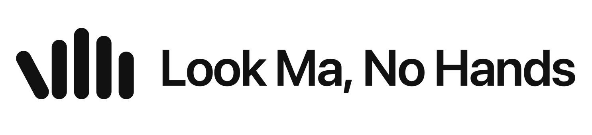

<picture>
  <source media="(prefers-color-scheme: dark)" srcset="Assets/png/lockup-dark@2x.png">
  
</picture>

A voice-first macOS app that controls your screen entirely by voice — built for
hands-free use. Say a wake word, then dictate a note or issue a screen command.

Native SwiftUI menu-bar app for macOS 14+, universal (Apple Silicon and Intel).
Speech is recognized **on-device** (Apple Speech); the intelligence (command
routing, summaries) runs through the **Anthropic Messages API** (Claude).

## What it does

1. **Wake word** — continuous on-device listening for "Hey Mama".
2. **Two capture modes** after waking:
   - **Command** → Claude turns a spoken request into an ordered **plan** of
     steps — open app, open URL (in a named browser or the default), keystroke
     shortcut (e.g. new tab = ⌘T), click / type / scroll — executed via the
     Accessibility API + CGEvent. One request can carry several action items.
   - **Dictation** → say "take a note"; it records until you pause, then Claude
     returns a **TLDR summary + action items + cleaned transcript** (Wisprflow-style).
3. **Clarifies when unsure** — if a request is ambiguous, the app doesn't guess:
   it shows a question with clickable options in the menu-bar panel and speaks
   it aloud. Answer by clicking or just by saying your answer.
4. **Speaks back** — spoken confirmations and questions via **ElevenLabs** when
   you add its API key (natural voice, low latency), or the built-in macOS voice
   otherwise. Recognition is muted while it talks so it never hears itself.

## Architecture

| File | Role |
|---|---|
| [LookMomNoHandsApp.swift](Sources/LookMomNoHands/LookMomNoHandsApp.swift) | `@main` menu-bar app + panel UI |
| [AppCoordinator.swift](Sources/LookMomNoHands/AppCoordinator.swift) | Orchestrates wake → transcribe → Claude → act |
| [VoiceListener.swift](Sources/LookMomNoHands/VoiceListener.swift) | Single always-on speech pipeline (wake word + transcription) |
| [ClaudeClient.swift](Sources/LookMomNoHands/ClaudeClient.swift) | Messages API: forced-tool plan routing + json_schema report |
| [ScreenController.swift](Sources/LookMomNoHands/ScreenController.swift) | Accessibility search + CGEvent click/type/scroll/keystroke, open app/URL |
| [Speaker.swift](Sources/LookMomNoHands/Speaker.swift) | Spoken replies: ElevenLabs TTS with system-voice fallback |
| [AppStore.swift](Sources/LookMomNoHands/AppStore.swift) | Disk-backed transcript store + activity log |
| [DashboardView.swift](Sources/LookMomNoHands/DashboardView.swift) | Dashboard window: transcripts + activity tabs |
| [Models.swift](Sources/LookMomNoHands/Models.swift) | Shared value types + frozen app-identity strings |
| [KeychainStore.swift](Sources/LookMomNoHands/KeychainStore.swift) | API key storage |
| [BrandMark.swift](Sources/LookMomNoHands/BrandMark.swift) | The mark as a drawn `Shape` + the menu-bar template image |

Logo, app icon and brand rules live in [Assets/](Assets/README.md);
`./Scripts/render_icon.sh` regenerates every raster from the SVG masters.
| [LicenseStore.swift](Sources/LookMomNoHands/LicenseStore.swift) | Trial clock + offline Ed25519 licence verification |
| [web/](web/) | nohandsapp.com — marketing site, Stripe checkout, licence API |

## Data & dashboard

Everything is stored locally under `~/Library/Application Support/LookMaNoHands/`:

- **`transcripts.jsonl`** — one JSON object per command / dictation, appended forever
  (id, date, kind, transcript, and for dictations the summary + action items).
- **`activity.log`** — a timestamped log of everything the app does, one line per
  event: `ISO8601: [subsystem] message` (subsystems: `app`, `wake`, `asr`,
  `claude`, `action`, `dictation`, `error`).

Open the **Dashboard** button in the menu-bar panel for a searchable view of all
transcripts and the live activity stream, with copy / reveal-in-Finder.

## Build & run

```sh
./Scripts/build_app.sh          # builds + assembles + ad-hoc signs build/LookMomNoHands.app
open build/LookMomNoHands.app
```

`swift build` alone compiles/typechecks but the permission prompts and TCC grants
need the real `.app` bundle the script produces. `swift test` runs the pure-logic
suite in `Tests/` — it needs the full Xcode toolchain (Command Line Tools alone
ship no XCTest); if `xcode-select` points at the CLT, run
`env DEVELOPER_DIR=/Applications/Xcode.app swift test`.

### First-run setup

1. Enter your Anthropic API key in the menu-bar panel (stored in Keychain).
   Or, for dev, export `LMNH_ANTHROPIC_API_KEY` before launching.
2. Grant permissions in **System Settings → Privacy & Security**:
   - **Microphone** and **Speech Recognition** — prompted on first launch.
   - **Accessibility** — add the app manually; required to click, type, and
     send keystroke shortcuts. (Opening apps and URLs works without it.)
3. Optional: add an **ElevenLabs API key** in the panel (or export
   `LMNH_ELEVENLABS_API_KEY`) for natural spoken replies; without it the app
   uses the system voice. Override the voice with `LMNH_ELEVENLABS_VOICE`.
4. Click **Start listening**, say the wake word, then speak a request.

## Model choices

- **Command routing** uses `claude-haiku-4-5` with forced tool use — low latency
  for the click-on-screen hot path.
- **Dictation reports** use `claude-opus-4-8` with `output_config.format` +
  adaptive thinking — quality where it matters.

Swap models in [ClaudeClient.swift](Sources/LookMomNoHands/ClaudeClient.swift).

## Status / next steps

Working skeleton, compiles and bundles clean. Natural extensions:
- Vision fallback: when the Accessibility search misses, send a screenshot to
  Claude and click by returned coordinates (ScreenCaptureKit + Screen Recording
  permission — deliberately not shipped until it's wired up).
- Streaming transcription display in the panel.
- Custom/trainable wake word (Porcupine) if the Apple phrase match is too loose.
